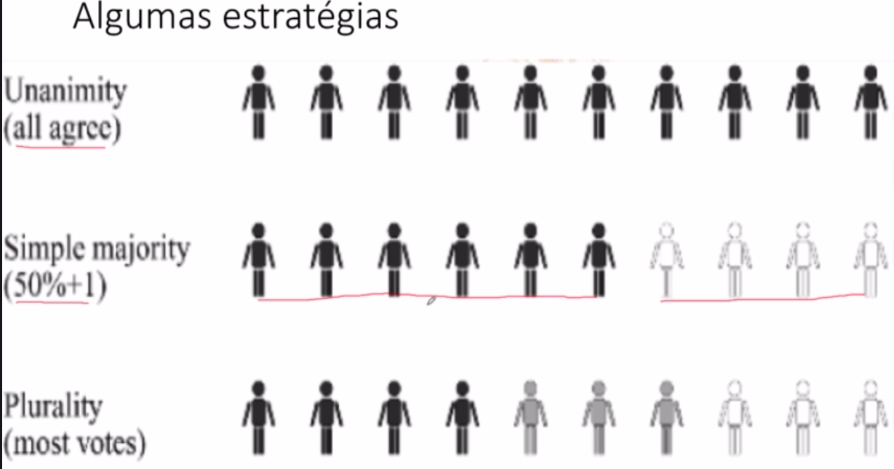
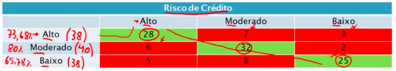
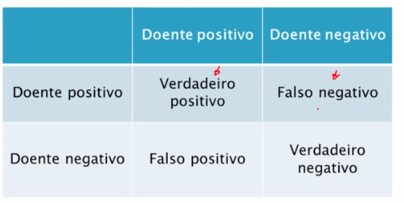
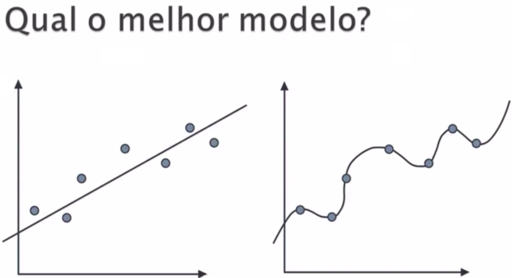
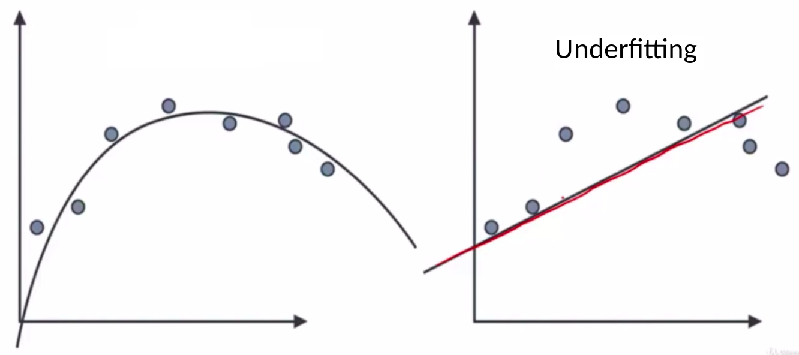
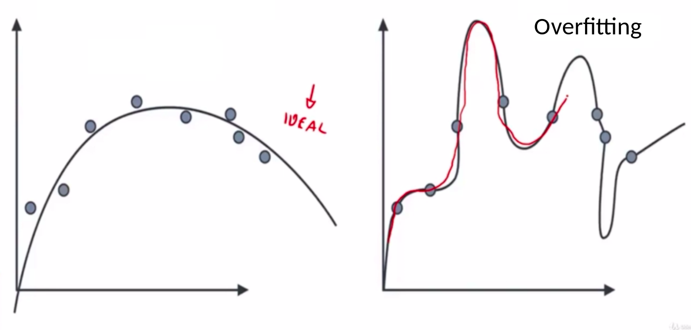

# Avaliar Classificadores ML

---

---

---

# Combinação e Rejeição de Classificadores

````
O assunto sobre combinação e rejeição de classificadores não é tão comum assim no cenário de Machine Learning. Você encontrará algum material em capítulos sobre regressão em livros de aprendizagem de máquina. Abaixo segue duas leituras complementares:

Review of Classifier Combination Methods

https://www.semanticscholar.org/paper/Review-of-Classifier-Combination-Methods-Tulyakov-Jaeger/05ee6de4a3318bed7bc2fee2b84da43f0f947ece


Classification with rejection concepts and evaluations:

https://www.researchgate.net/publication/269873214_Classification_with_rejection_concepts_and_evaluations
````

## Combinação de Classificadores

Com relação a combinação de classificadores,
+ Permite uma classificação mais precisa
+ Busca-se o melhor conjunto de classificadores
+ DIminui o risco de selecionar um classificador individual inadequado

### Ideia

Juntar mais de um classificador para ter mais certeza

### Técnicas



UNANIMIDADE
+ Todos devem votar numa classe

MAIORIA
+ A classe com 50% + 1

PLURALIDADE
+ Aclasse que receber mais votos

## Rejeição de Classificadores

Em aplicações reais um classificador
+ Aponta uma única hipótese
+ Rejeita o resultado se nâo tiver certeza suficiente


A depender dos cenários, a porcentagem de certeza do classificador você aceita ou nâo a hipótese do classificador
 
Muito usado em sistemas reais, quando se tem que ter muita certeza da resposta

**QUESTÃO DO IA_EXPERT**
Na rejeição de classificadores, o percentual a ser considerado para caracterizar a rejeição da resposta do classificador deve ser a mesma para todos os tipos de problemas. Por exemplo, se em um sistema de venda de veículos for utilizado o percentual de 85%, em um sistema médico esse percentual também é válido (FALSO)


---

---

---

## O que vamos ver
• Matriz de confusão
• Verdadeiro positivo e falso positivo
• Validação cruzada
• Underfitting e overfitting
• Implementação da validação cruzada
• Treinamento e teste x validação cruzada
• Teste de Fridman e Nemenyi (No R)


Leituras Recomendadas:

````
Livro Evaluating Machine Learning Models de Alice Zheng: esse é um dos poucos livros específicos sobre o assunto e é bastante didático, mostrando como avaliar algoritmos de classificação, regressão e abordando também configuração de parâmetros dos algoritmos. Importante: quando essa aula foi postada o livro estava disponível para download gratuito!

Artigo How to Correctly Validate Machine Learning Models: discute vários aspectos sobre tratamento de erros

Capítulo Cross-validation do livro Statistics for Machine Learning de Pratap Dangeti

Livro Overfitting de Jesse Russel e Ronald Cohn

Capítulo Overfitting and Its Avoidance do livro Data Science for Business de Foster Provost e Tom Fawcett
````

## Matriz de Confusão


A linha representam os registros da classe

As colunas são as previsões feitas para cada registro

O nome se refere à confusâo que o algoritmo de ML pode fazer.

Ele é uma matriz que, na diagonal principal (da esq => dir) mostra os registros que foram classificados corretamente. E nos outros campos sâo os erros


No exemplo acima, avaliando a classificação de **ALTO** podemos concuir que:

+ 28 Registros ALTO foram classificados corretamente como ALTO (ACERTOU)
+ 7 registros ALTO foram classificados MODERADO (ERROU)
+ 3 registros ALTO foram classificados BAIXO (ERROU)
+ 6 registros MODERADOS foram classificados como ALTO (ERROU)
+ 5 registros BAIXO foram classificados como ALTO (ERROU)

É necessário saber o percentual de acerto para cada classe. Para fazer isso, basta somar a linha que se obtem o total e faz (acerto/total), como feito na imagem abaixo. Assim, você saber o percentual de acerto para acertar uma classe.



## Critério para Análise das possibilidades dos número de classe

**Seu Modelo ML deve ter uma chance maior que 1/númer_de_classes**

No exemplo acima, o acerto pra cada classe deve ser maior que 33%, pois, senão, seria melhor escolher a classe de forma randômica


## Falso Positivo



Os que começam com Falso, são as classificações são falsas:

Tomar cuidado com Falso positivo e Falso Negativo

### Validação Cruzada : Divisão da Base

Por que CrossValidation: Em geral, fazemos a divisão da base em cerca de 75% ou mais para treinar e o restante para testar. Mas, muitas vezes podemos perder bons dados nesse 25% de teste que poderiam ser mais úteis no treinamento.

Então, existe um método muito usado em artigos científicos chamados  K-Fold CrossValidation. 

**K CrossValidation:** A ideia é dividir a base em K partes e pegar 1 delas de testes e K - 1 para treinamento. Mas, desa vez, como tá dividido em K partes, faz o treinamento/testes com partes diferentes.

Na imagme abaixo dividimos em 4 partes e a cada iteração, uma parte diferente é usada para teste. Como pode observar, pode-se obter resultados diferentes.

A avaliaçâo do algoritmo é a média para cada teste.

**K = 10 é o valor mais utilizado**. Escolhendo ele, então, eu divido a minha base em 10 partes, uso uma parte para terinamento e o restante (90%) para teste

|       | K = 2 | K = 3 | K = 4 | K = 5 | K = 6 | K = 7 | K = 8 | K = 9 | K = 10 |
| ----- | ----- | ----- | ----- | ----- | ----- | ----- | ----- | ----- | ------ |
| Train | 50%   | 66%   | 75%   | 80%   |       |       |       |       | 90%    |
| Teste | 50%   | 33%   | 25%   | 20%   |       |       |       |       | 10%    |

Ele vai fazer 10 testes, variando a base de teste e de treino 10 vezes e entẫo, voltara a média dessas avaliações.


### Estratificação - `StratifiedKFold`

Mesmo que se divida a base em terino e teste para cada K. 

**QUAL A GARANTIA DE QUE CADA K TENHA A MESMA QUANTIDADE DE REGISTROS PARA CADA CLASSE**

**Exemplo infeliz:** Imagina que você divida a base em 50% para uma classificação binária. Se a os 50% que você pegar para treinamento só tiver 1 classe, então, ele nâo vai treinar corretamente para avaliar a outra classe.

Entâo, temos que garantir que no treinamento haja a mesma proporçâo de amostrar por classe

## Underfitting e overfitting



Perceba que, apesar do da direita acertar todos os pontos, ele parece muito viciado. Se você incesrir um novo modelo, percabea que o eror pode ser maior que o outro mesmo aprecendo certinho, comona imagem abaixo.


UnderFiting (Subestimando o problema): Quando você tem um problema complexo

+ Resultados ruins na base de treinamento



Overfiting (SuperAdaptado ao problema):

+ Resultados bons na base de treinamento
+ Resultados ruins na base de teste 
+ Pois ele está muito específico, como se tive-se memorizado os dados e por isso, vai apresentar erros quando recebers amostras diferentes dos dados de treinamento


