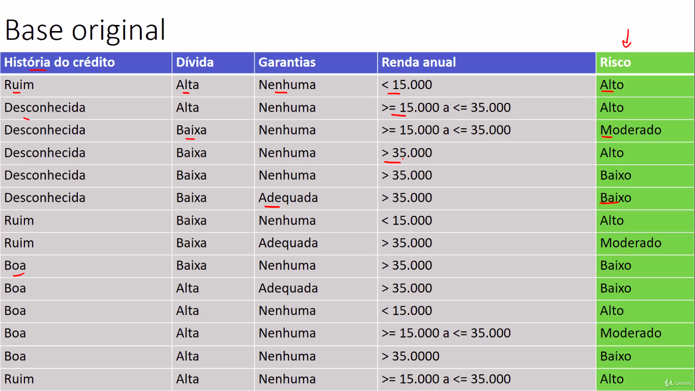
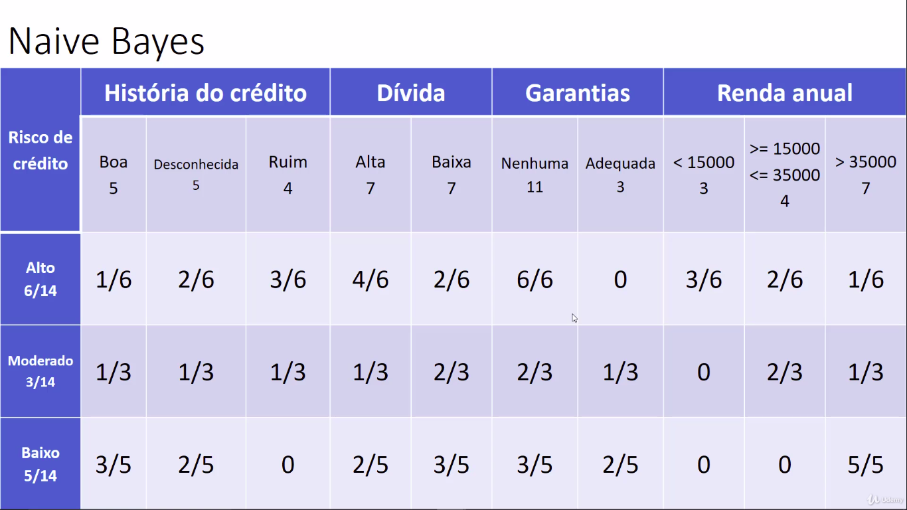
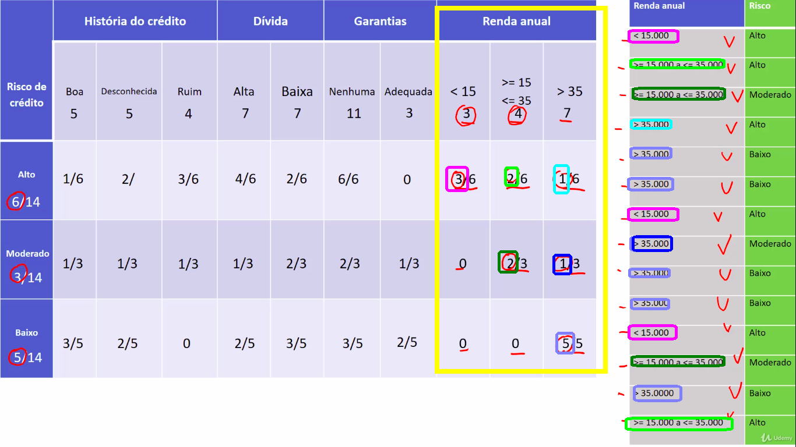
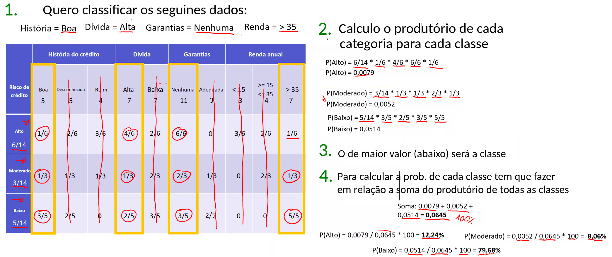

# Naive Bayes

Links:
https://www.vooo.pro/insights/6-passos-faceis-para-aprender-o-algoritmo-naive-bayes-com-o-codigo-em-python/

Algoritmo de ML para classificação

### O que é

O que é o algoritmo Naive Bayes?
É uma técnica de classificação baseado no teorema de Bayes com uma suposição de independência entre os preditores. Em termos simples, um classificador Naive Bayes assume que a presença de uma característica particular em uma classe não está relacionada com a presença de qualquer outro recurso. Por exemplo, um fruto pode ser considerado como uma maçã se é vermelho, redondo, e tiver cerca de 3 polegadas de diâmetro. Mesmo que esses recursos dependam uns dos outros ou da existência de outras características, todas estas propriedades contribuem de forma independente para a probabilidade de que este fruto é uma maçã e é por isso que é conhecido como ‘Naive’ (ingênuo).

O modelo Naive Bayes é fácil de construir e particularmente útil para grandes volumes de dados. Além de simples, Naive Bayes é conhecido por ganhar de métodos de classificação altamente sofisticados.

Teorema de Bayes fornece uma forma de calcular a probabilidade posterior P (C | X) a partir de P (C), P (x) e P (X | c). Veja a equação abaixo:

probabilidade Bayes
Acima,

P (c | x) é a probabilidade posterior da classe (c, alvo) dada preditor (x, atributos).
P (c) é a probabilidade original da classe.
P (x | c) é a probabilidade que representa a probabilidade de preditor dada a classe.
P (x) é a probabilidade original do preditor.
Como o algoritmo Naive Bayes funciona?
Vamos entender isso usando um exemplo. Abaixo eu tenho um conjunto de dados de treinamento de clima e da correspondente variável-alvo ‘Play’ (sugerindo possibilidades de jogar). Agora, precisamos classificar se os jogadores vão jogar ou não com base na condição meteorológica. Vamos seguir os passos abaixo para realizar a operação.

Passo 1: Converter o conjunto de dados em uma tabela de frequência

Passo 2: Criar tabela de Probabilidade ao encontrar as probabilidades de tempo Nublado = 0,29 e probabilidade de jogar = 0,64.

tabela bayes
Passo 3: Agora, use a equação Bayesiana Naive para calcular a probabilidade posterior para cada classe. A classe com maior probabilidade posterior é o resultado da previsão.

Problema: Os jogadores irão jogar se o tempo está ensolarado. Esta afirmação está correta?

Podemos resolver isso usando o método discutido acima de probabilidade posterior.

P (Sim |Ensolarado) = P (Ensolarado | Sim) * P (Sim) / P (Ensolarado)

Aqui temos P (Ensolarado | Sim) = 3/9 = 0,33, P (Ensolarado) = 5/14 = 0,36, P (Sim) = 9/14 = 0,64

Agora, P (Sim | Ensolarado) = 0,33 * 0,64 / 0,36 = 0,60, que tem maior probabilidade.

Naive Bayes usa um método similar para prever a probabilidade de classe diferente com base em vários atributos. Este algoritmo é usado principalmente em classificação de texto e com os problemas que têm múltiplas classes.

### Aplicações
Previsões em tempo real: Naive Bayes é um classificador de aprendizagem voraz e com certeza rápido. Assim, pode ser usado para fazer previsões em tempo real.

Previsões multi-classes: Este algoritmo também é conhecido pela funcionalidade de previsão multi-classes. Aqui podemos prever a probabilidade de múltiplas classes das variáveis-alvo.

Classificação de textos/Filtragem de spam/Análise de sentimento: classificadores Naive Bayes utilizados principalmente em classificação de textos (devido a um melhor resultado em problemas de classes múltiplas e regra de independência) têm maior taxa de sucesso em comparação com outros algoritmos. Como resultado, é amplamente utilizado na filtragem de spam (identificar spam) e Análise de Sentimento (em análise de mídia social, para identificar sentimentos positivos e negativos dos clientes)

Sistema de Recomendação: o classificador e a filtragem colaborativa Naive Bayes em conjunto constroem um sistema de recomendação que utiliza técnicas de machine learning e mineração de dados para filtrar a informação invisível e prever se um usuário gostaria de um determinado recurso ou não

### Prós-COntras

Quais são os prós e contras de Naive Bayes?
Prós:

+ É fácil e rápido para prever o conjunto de dados da classe de teste. Também tem um bom desempenho na previsão de classes múltiplas.
+ Quando a suposição de independência prevalece, um classificador Naive Bayes tem melhor desempenho em comparação com outros modelos como regressão logística, e você precisa de menos dados de treinamento.
+ O desempenho é bom em caso de variáveis categóricas de entrada comparada com a variáveis numéricas. Para variáveis numéricas, assume-se a distribuição normal (curva de sino, que é uma suposição forte).

Contras:

+ Se a variável categórica tem uma categoria (no conjunto de dados de teste) que não foi observada no conjunto de dados de treinamento, então o modelo irá atribuir uma probabilidade de 0 (zero) e não será capaz de fazer uma previsão. Isso é muitas vezes conhecido como “Zero Frequency”. Para resolver isso, podemos usar a técnica de alisamento. Uma das técnicas mais simples de alisamento é a chamada estimativa de Laplace.
+ Por outro lado naive Bayes é também conhecido como um mau estimador, por isso, as probabilidades calculadas não devem ser levadas muito a sério.
+ Outra limitação do Naive Bayes é a suposição de preditores independentes. Na vida real, é quase impossível que ter um conjunto de indicadores que sejam completamente independentes.

DESVANTAGEM

+ NaiveByes trata cada coluna como independente o que nem sempre é verdade

### Exemplo do Curso : Base de Risco

### Como funciona

Utilisa estatística e Probabilidade pura.

Gera uma tabela de probabildiades para cada dado relacionado a classe de acordo com o histórico dado.

Você conta quantas vezes um determinado dado está relacionado a uma classe e dividide pela qunatidade total. A seguir a um exemplo.

#### Exemplo do NaiveBayes

Exemplo de data set 

+ Vamos prever o Risco com base no Histórico de Crédito, usando uma única feature

| Histórico de Crédito | Risco    |
| -------------------- | -------- |
| Ruim                 | Alto     |
| Desconhecido         | Alto     |
| Desconhecido         | Moderado |
| Desconhecido         | Alto     |
| Desconhecido         | Baixo    |
| Desconhecido         | Baixo    |
| Ruim                 | Moderado |
| Ruim                 | Baixo    |
| Boa                  | Baixo    |
| Boa                  | Baixo    |

Tabela do Naive Bayes (Distribuição de Probabilidade)

| Risco de Crédito     |           | Histórico do Crédito |           |
| -------------------- | --------- | -------------------- | --------- |
|                      | Boa       | Desconhecido         | Ruim      |
| Alto    = 3/10 = 30% | 0/2 = 0%  | 2/3 = 66%            | 1/3 = 33% |
| Mode = 2/20 = 20%    | 0/2 = 0%  | 1/2 = 50%            | 1/2 = 50% |
| Baixo = 5/10 = 50%   | 2/5 = 40% | 2/5 = 40%            | 1/5= 20%  |

**Como aplicar Naive Bayes num Registro**

+ Classifico um registro fazendo a probabilidade para cada classe
+ Exemplo: **Registro: (Histórico de Crédito : Desconhecido)**
  + P(Alto) = 30% *  66% = 19,8%
  + P(Moderado) = 20% * 50% = 10%
  + P(Baixo) = 50% * 40% =  20% !!!!!
+ O calculo é o produtório para cada classe, sendo a multiplicação dos possíveis valores para cada features
+ //OBS: Esse caso é bem simples, é uma única *feature* se tiver mais, são mais multiplicações que irá fazer mas da mesma forma.
+ O resultado final será:
+ Calculo a doma dos resultados das classes:
  + 0,198 + 0,10 + 0,2 = 0,498
+ Esse será o 100%, agora eu divido cada resultado por esse valor
  + P(Alto) = 0,198/0,498 = 39,7 %
  + P(Moderado) = 0,10/0,498 = 20%
  + P(Baixo) = 0,2/0,498 = 40%
+ **RESPOSTA: Será P(Baixo) com 40% de Chance**

### Como funciona a classificação

O algoritmo pega as colunas dos dados da row.

Faz o produtório das probabildiade e assimm calcula uma prob para cada classe. O maior valor será o dado que será classificado. ESSA PROBABILIDADAE NÃO É A PORCENTAGEM.

Para encontrar a probabildidade, tem que somar todas as prbs de cada classe e asism, apra cada classe, dividir sua prob pelo total. 

### Correçâo Laplaciana

Como faz um produtório, pode ter a chance de dar 0 se nâo hover uma unica row em que um dado dê numa classe. ENtâo é feito uma correçâo laplaciana na tabela. VOcê adiciona um único registro para esse dado, assim, no produtório nâo tem chance nenhuma de dar 0.

[COLOCAR IAMGENS DE NAYVIE_BAYES 01 A 06]

